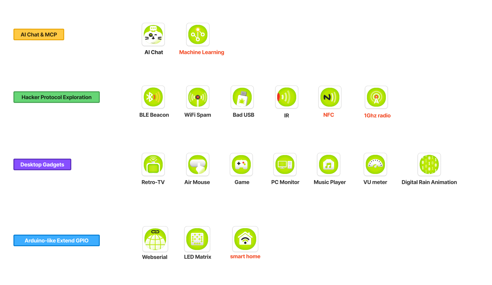
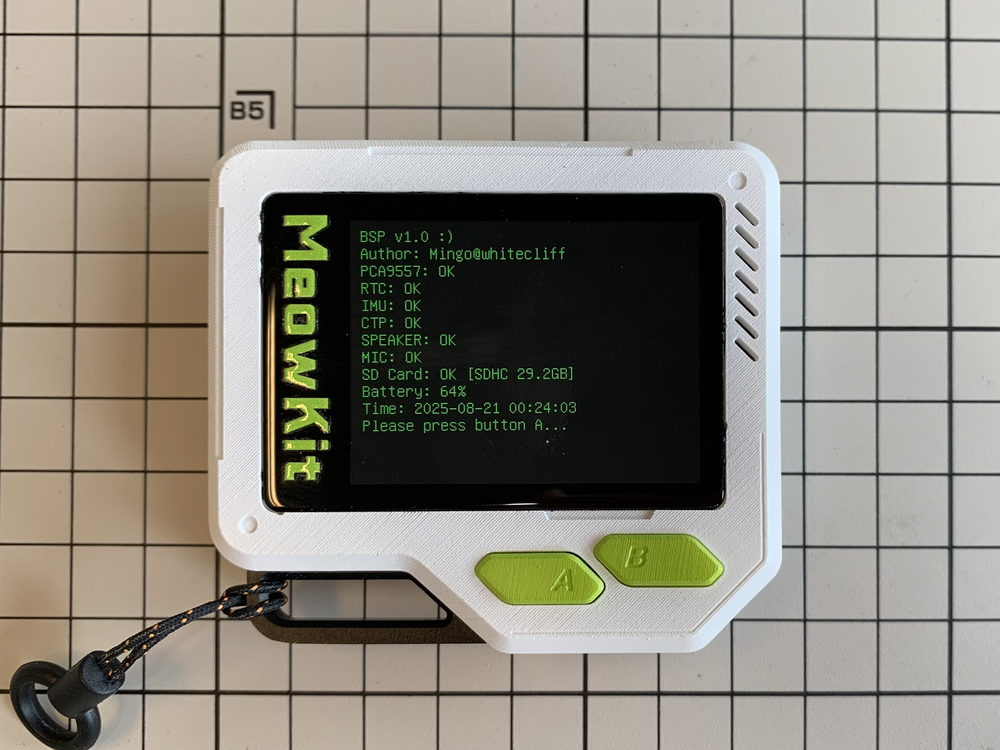
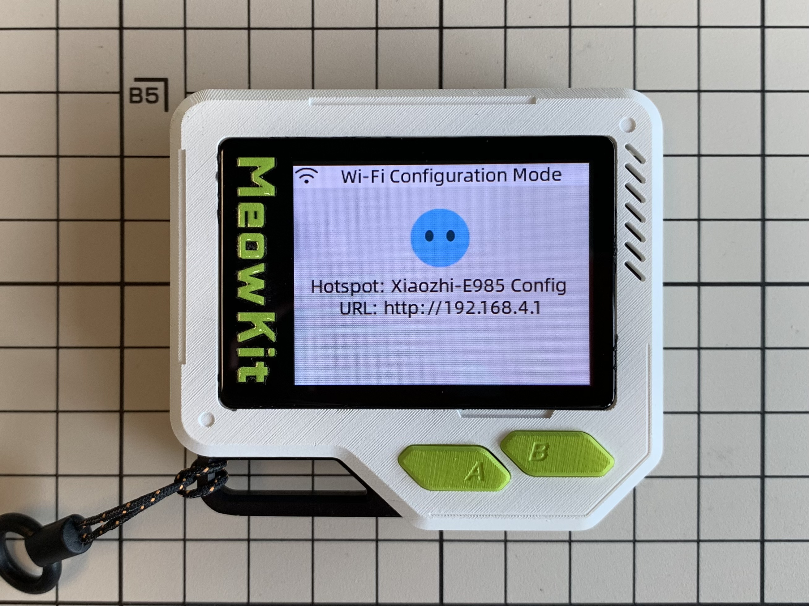
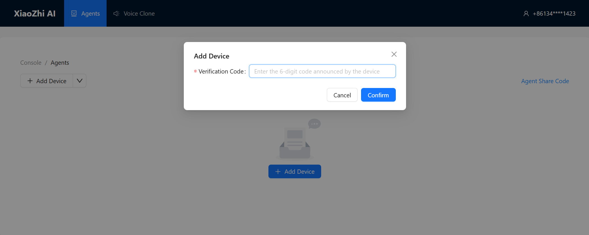

## **MeowKit — Versatile Device for Makers**


This is a **pocket-sized multi-tool** device for AI Chat & MCP Control, protocol hacking exploration, DIY hardware expansion, desktop gadget integration, **open-source SDK**, and more.  **Built for makers and hackers**, it is designed to be a powerful yet easy-to-use development **platform**.

--
## 🎉 Coming Soon: MeowKit!

Get ready! Our **MeowKit — Versatile Device for Makers** is almost here.  

🚀 Stay tuned and support us on **Kickstarter**:  
[MeowKit on Kickstarter](https://www.kickstarter.com/projects/1915038505/meowkit-versatile-device-for-makers)  

🥳 Let's celebrate the launch together! 🎊




### Unboxing

When you first receive the package carefully prepared and shipped by the MeowKit team, please check the contents and read the important notes.

#### 📦 Package Contents

| #  | Item                      | Description/Notes    |
|----|---------------------------|----------------------|
| 1  | **MeowKit**               | Main device          |
| 2  | **Lanyard**               | Wrist/neck strap     |
| 3  | **Micro SD Card**         | Lexar 32GB           |
| 4  | **Card Reader**           |                      |
| 5  | **USB Type-C Cable**      |                      |
| 6  | **Leather USB Cable Tie** |                      |
| 7  | **Postcard**              |                      |
| 8  | **Breadboard Jumper Wires** | For prototyping    |

#### Possible Issues & Solutions

##### a. Laser char
- The black residue on the edges of the laser-cut honeycomb cardboard is harmless.  
  - Avoid direct contact with the cut edges.  
  - If any dust gets on your hands, simply wash them before handling the device. 

##### b. Shipping and handling
- During transport, the battery may be discharged or the back cover may become loose.  
  - Recharge using the USB-C cable until the red LED turns off (indicating full charge).  
  - Tighten the back cover screws with a T5 screwdriver if needed.  

##### c. A/B button stiffness
- The A/B buttons may feel slightly stiff at first.  
  - With repeated use, pressing and rebound will become smoother and the tactile feel will improve.  

---

### Getting Started

#### Firmware Update

1. **Download the firmware**  
   - Visit [MeowKit GitHub](https://github.com/happy-mingo/MeowKit) → click **Code** → **Download ZIP**, and save the firmware files to your computer.  

2. **Open the flashing tool**  
   - In your browser, go to: [ESP Launchpad](https://espressif.github.io/esp-launchpad/)  

3. **Connect the device**  
   - Connect MeowKit to your PC via USB.  
   - Click **Connect**, then select `USB JTAG/serial debug unit (COM xx)`.  

4. **Confirm connection**  
   - Once connected, the webpage will display:  
     ```
     Connected to device: ESP32-S3
     ```
   - The **Connect** menu will switch to **Disconnect**, confirming a successful COM connection.  

5. **Select firmware files and set flash addresses**

   **Hacker Protocol & Desktop Gadgets firmware**  
   - Click **Selected file and flash address**, then add:  
     - `bootloader.bin` → `0x0`  
     - `partitions.bin` → `0x8000`  
     - `meowkit.bin` → `0x10000`  
   - Click **Program** to start flashing.  

   **AI Chat & MCP firmware**  
   - Click **Selected file and flash address**, then add:  
     - `bootloader.bin` → `0x0`  
     - `partition-table.bin` → `0x8000`  
     - `ota_data_initial.bin` → `0xd000`  
     - `srmodels.bin` → `0x10000`  
     - `xiaozhi.bin` → `0x100000`  
   - Click **Program** to start flashing.  

7. **Monitor flashing progress**  
   - During flashing, the browser will switch to the **Console** view and display progress.  
   - Once you see:  
     ```
     Writing complete 100% 
     Leaving...
     ```
     the flashing is successfully finished.  

8. **Restart the device**  
   - The device does not reboot automatically after flashing.  
   - Click the **Reset Device** button on the webpage, then click **Confirm** to reboot and run the newly flashed firmware.  

---

### MeowKit Getting Started Guide

---

#### Hacker Protocol&Desktop Gadgets


1. **Power on**: Press and hold the power button for 3 seconds.  

2. **Initialize BSP**: On first boot, follow the on-screen prompt to press the **A/B buttons** (display shows *“bsp init done”*).  

   

3. **Enter main interface**: MeowKit will automatically boot into the **main interface**.  

4. **Open an app**: Go to the **Apps Menu**, tap an **icon** to launch an app.  

   

5. **Exit an app**: Long-press the **B button** to exit and return to the **Apps Menu**. 

--- 
#### AI Chat&MCP

It integrates large language models (LLMs) such as Qwen, DeepSeek, and ChatGPT, supporting natural, multilingual conversations in Chinese, English, Japanese, Korean, and more. It features real‑time speech recognition and human‑like TTS voice synthesis. 


#### 1. First Boot

a. After flashing and rebooting the device, **MeowKit** will enter the **Wi-Fi Configuration Page** for the first time.  
b. On your phone or computer, open **Wi-Fi settings**, find and connect to the hotspot **`Xiaozhi-6BF1`**.  



c. It will automatically redirect (or you can manually open):  👉 [http://192.168.4.1](http://192.168.4.1)  
d. Select your Wi-Fi network on the page and enter the password.  


#### 2. Successful Network Connection

- The device will **play a machine code** and display it on the screen.
  
- Open your browser and visit 👉 [https://xiaozhi.me/](https://xiaozhi.me/)  
- Enter the displayed **machine code** to bind your device with the AI agent.

#### 3. Personalization

On the [xiaozhi.me](https://xiaozhi.me/) platform, you can customize:  
- **Role**  
- **Voice**  
- **Memory**  
- **Interaction preferences**  
Click **Save** to apply the settings.


#### 4. Getting Started

Press the device’s **A button** or wake it up with your voice: **Hi ESP32**.  
Now you can start talking to it!

---

#### Interface Guide

The graphical interface includes a clock, home screen, app menu, SD-card file manager, and control center.  
With SD-card file management (littleFS) and the Mooncake multi-app management and scheduling framework for microcontrollers (by Forairaaaaa), you can easily build and add your own applications.


---

#### Hardware Specifications
*(To be added)*

---

### Join Us

From the very beginning of this project, we have embraced **openness and transparency** as our core values.  
We believe in open-source, the strength of the community, and the idea that enthusiasts can create amazing projects without the backing of large corporations.  

We warmly invite anyone interested to **contribute, collaborate, and help build MeowKit together!** 🚀


